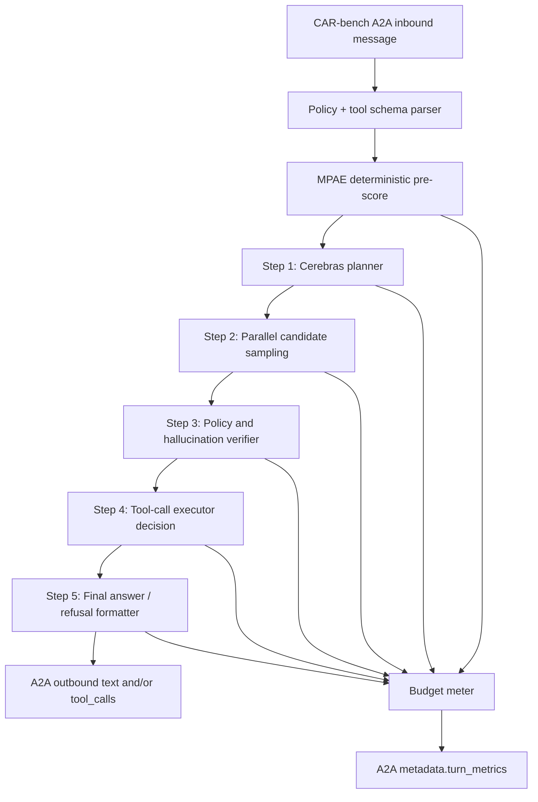

# CAR-bench Track 2 Adaptation Plan

## Why this matters

Nahed Innovation has been selected for Track 2 of the CAR-bench Challenge @ IJCAI-ECAI 2026. Track 2 now requires direct Cerebras `gpt-oss` inference instead of the previously planned Codex-agent runtime.

The Track 2 design goal for Autex is therefore:

```text
Use fast Cerebras inference for more reliability checks while staying inside strict compute accounting.
```

## External constraints to implement

| Constraint | Project rule |
| --- | --- |
| Provider/runtime | Direct Cerebras-hosted `gpt-oss` inference |
| Sequential LLM calls | At most 5 sequential LLM calls per baseline LLM step |
| Parallel calls | Allowed inside a step; counted as the same sequential depth when grouped |
| Token usage | Average up to 500K tokens per task, including prompt, reasoning/thinking, and output |
| Reporting | Aggregate token usage into A2A `Message.metadata.turn_metrics` |
| Report artifact | Include an architecture diagram for sequential-call audit |

## Proposed Autex / MPAE Track 2 harness



## Sequential-call budget

The recommended production harness should reserve the five sequential calls as follows:

1. **Planner**: identify task type, missing info, policy hazards, and candidate action class.
2. **Parallel candidate sampling**: run multiple Cerebras calls in parallel for tool-call candidates or refusal/clarification alternatives.
3. **Verifier**: check hallucination, tool availability, ambiguity, policy compliance, and whether clarification is required.
4. **Executor decision**: emit exactly one benchmark-visible tool-call plan or user-facing response class.
5. **Finalizer**: produce concise A2A output and aggregate token metrics.

Parallel calls in step 2 should share the same `sequentialStep` value so the budget meter counts them as one depth level.

## Token accounting

The project now includes `src/lib/car-bench-track2-budget.ts`, which can:

- summarize prompt/completion/thinking tokens,
- count unique sequential steps,
- enforce the 5-step sequential limit,
- enforce the 500K token-per-task budget,
- produce A2A-compatible `turn_metrics` metadata.

Demo command:

```bash
npm run carbench:budget
```

## Integration with MPAE

MPAE remains deterministic and does not consume LLM budget. It should run before Cerebras calls to:

- classify risk and ambiguity,
- select a context such as normal/critical/fleet/budget,
- lower unnecessary LLM calls for simple safe cases,
- prioritize verifier depth for high-risk or ambiguous user requests.

This preserves Track 2 compute for cases where it improves reliability.


## Reliability kernel for CAR-bench task types

The project now includes `src/lib/car-bench-reliability-agent.ts`, a deterministic pre-agent guard for common CAR-bench failure modes:

- **Base tasks**: checks required observation tools and policies before action.
- **Hallucination tasks**: refuses or defers when required tools, parameters, or observations are unavailable instead of fabricating success.
- **Disambiguation tasks**: resolves internally from preferences/context when possible and asks the user only when unresolved ambiguity remains.

Demo command:

```bash
npm run carbench:reliability
```

The demo currently covers the sunroof examples from the benchmark overview: weather-check policy, removed sunshade-tool hallucination prevention, and stored-preference disambiguation.
